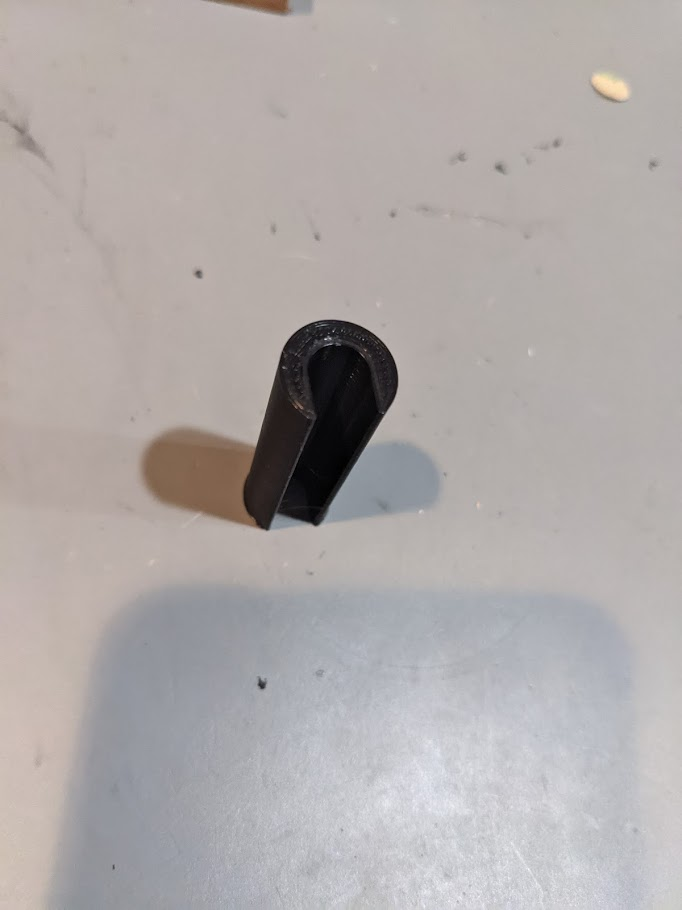
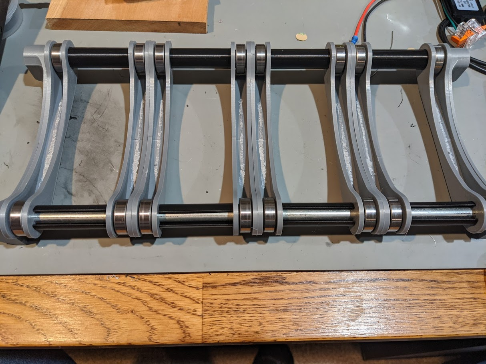

# TUSH Drybox Spacer

This is a spacer that fits onto the 5/16" rod in my 20QT Sterilite dry box.

# Changelog

2021/01/24 - Add photos

## Design

Autocad Fusion 360 

## Slicer

Ultimaker Cura 4.8.0

- Printer: Creality CR6 SE

- Layer Height: 0.2mm
- Infill Density: 20%
- Infill Pattern: Grid

- Filament: Inland PLA+ 1.75mm Black
- Material: PLA+
- Print Temperature: 215 degrees C

# Drybox Thingiverse designs

- [The Ultimate Spool Holder Dry Box by ritchrock](https://www.thingiverse.com/thing:2929701)
 - 2x *Sterlite-Rod-Holder.stl* - Rod holders for end of roller system
 - 8x *Side.stl* - bearing spacer sides (spin welded 2 sides together with dremel + filament)
- [ThermoPro TP50 Thermometer/Hygrometer Mount by bradcfisher](http://www.thingiverse.com/thing:3168310) 
 - 2x *F360_Thermopro_TP50_Mount_End.stl*
 - 4x *F360_Thermopro_TP50_Mount_Washer.stl*
- [Filament Enclosure Tap (1.75mm) by dottom22](https://www.thingiverse.com/thing:2139021)
 - 4x *Bowden_5mm_FIlter.stl* - [1/8" thick sticky back foam as washer cut to size](https://smile.amazon.com/gp/product/B071R4DR1R)
 - 4x *Filament-Enclosure-Tap-Cap.stl* - [1/16" thick sticky backed foam cut to size inside](https://smile.amazon.com/gp/product/B06ZZDMHGX)
 - 4x *Nut_96_Tollerance.stl*
 - 4x 4mm OD Bowden tube fitting (M6 thread) - Cheap ones came in [this kit](https://smile.amazon.com/gp/product/B07PV9LCLY)
- [Sterilite Dry Box Dessicant Container by mattthebaker](http://www.thingiverse.com/thing:3323912) 
 - 4 lids and boxes per drybox
 
# Preview

